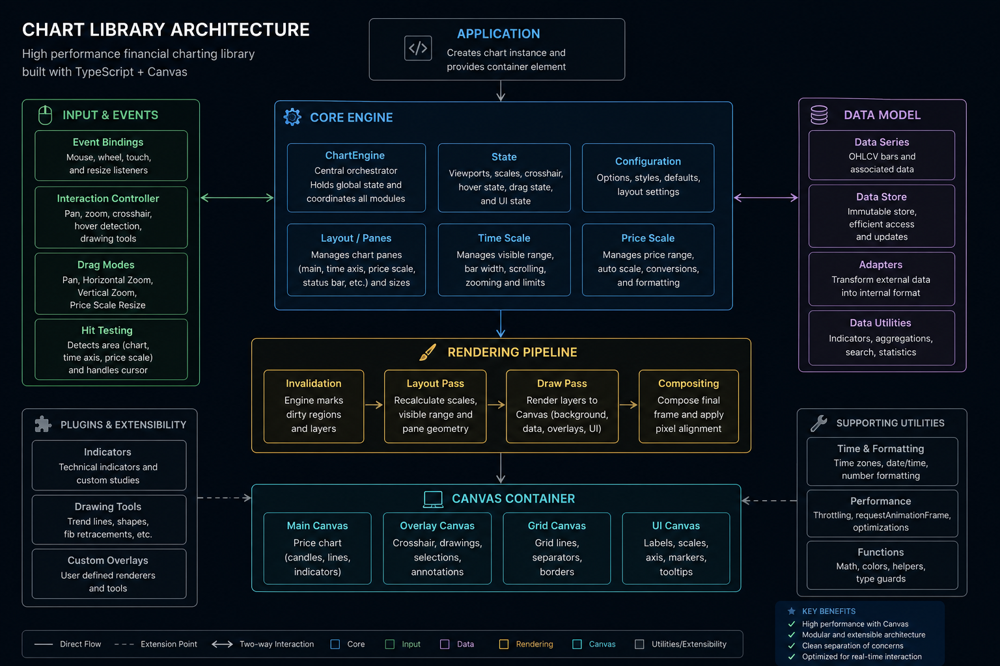

# Canvas Chart Engine

A high-performance financial charting engine built with **TypeScript** and the **HTML5 Canvas API**.

Designed from the ground up for professional trading applications, the engine focuses on performance, modularity, and extensibility while remaining framework-agnostic.

---

## Features

* High-performance Canvas renderer
* Modular architecture
* Infinite horizontal scrolling
* Smooth zooming
* Free chart panning
* Vertical price navigation
* Independent rendering layers
* Indicator system
* Multiple drawing tools
* Crosshair
* Live price tracking
* Custom overlays
* Price scale
* Time scale
* Scrollbar
* Responsive layout
* Mobile touch support
* Zero external dependencies

---

## Architecture



The engine is organized into independent modules that communicate through the central `ChartEngine` instance.

```
ChartEngine
│
├── Core
│   ├── Rendering
│   ├── Layout
│   ├── Events
│   ├── Time Scale
│   ├── Price Scale
│   └── Utilities
│
├── Series
│   ├── Candles
│   ├── Line
│   ├── Area
│   └── Custom Series
│
├── Indicators
│
├── Drawings
│
├── Overlay
│
└── UI
```

Every subsystem is isolated, making it easy to extend without modifying the rendering pipeline.

---

# Rendering Pipeline

The renderer is split into multiple canvas layers.

```
Main Layer
Overlay Layer
Price Scale
Time Scale
Drawing Layer
Interaction Layer
```

Only the layers that become dirty are redrawn, minimizing rendering cost.

---

# Interaction

The engine supports desktop and touch interactions.

### Mouse

* Crosshair
* Wheel zoom
* Horizontal zoom
* Vertical zoom
* Free panning
* Scrollbar dragging

### Touch

* One-finger pan
* Two-finger pinch zoom

---

# Price Navigation

The price viewport supports:

* Automatic scaling
* Manual vertical panning
* Manual vertical zoom
* Live price tracking
* Dynamic visible range computation

---

# Time Navigation

The time scale supports:

* Infinite right padding
* Real-time scrolling
* Smooth zoom
* Adaptive labels
* Virtual timestamps
* Trading session extension

---

# Rendering Philosophy

The engine does **not** redraw the entire chart every frame.

Instead, each subsystem owns a dirty flag.

```
Main
Overlay
Time Axis
Price Axis
Drawings
```

Only the modified layers are rendered.

This significantly improves performance during interaction.

---

# Project Structure

```
src/
│
├── chart/
├── renderer/
├── series/
├── indicators/
├── drawings/
├── overlay/
├── timeScale/
├── priceScale/
├── layout/
├── interaction/
├── utils/
└── ui/
```

Each directory contains a self-contained subsystem.

---

# Performance

The engine is designed to render thousands of candles while maintaining smooth interaction.

Optimizations include:

* Dirty rendering
* Virtual viewport
* Canvas layering
* Cached measurements
* Incremental redraws
* Adaptive label generation
* Minimal allocations

---

# Goals

This project aims to provide a lightweight yet professional financial charting engine that is:

* Fast
* Modular
* Extensible
* Framework independent
* Easy to customize

---

# Roadmap

* Multiple synchronized charts
* Advanced drawing tools
* Indicator marketplace
* Custom themes
* Plugin API
* Multiple panes
* Replay mode
* Animation system
* WebGL renderer
* Level II visualization

---

## License

GPL-3.0-only